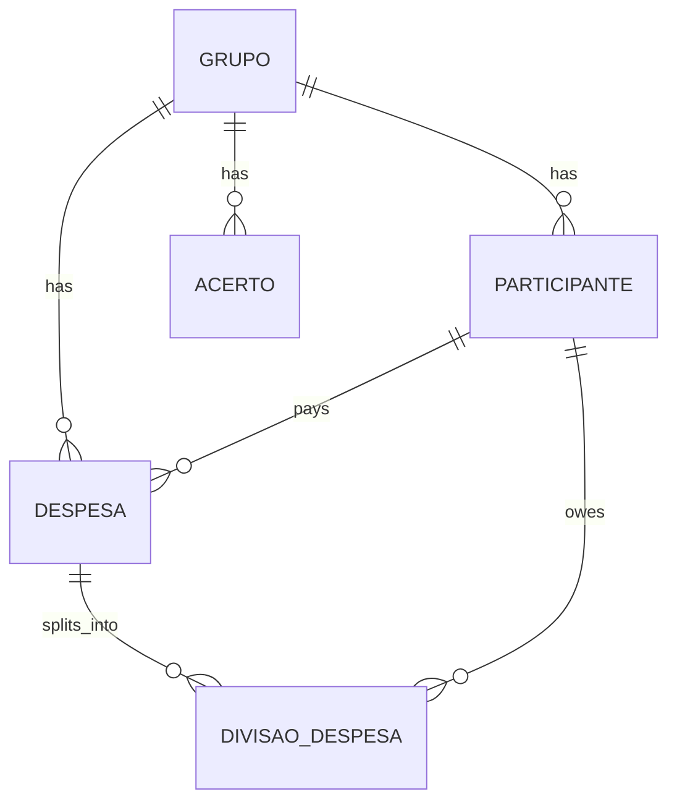

# Lanni.io 🦁

> A C# .NET API that ensures your group always pays its debts.

Lanni.io is an expense-splitting API (think Splitwise) built as a hands-on lab to learn the .NET ecosystem in depth: ASP.NET Core, Entity Framework Core, Dapper, async programming, messaging, Docker and cloud deployment.

> 🚧 **Status:** under construction. Currently in **Phase 2** (modeling + EF Core).

---

## What it does (planned)

- Create **groups** (a trip, an apartment, a couple) and add **participants**
- Register **expenses**: who paid, how much, and who shares it (equal split)
- Handle the "lost cent" problem (R$ 100 / 3 = 33.33 + 33.33 + 33.34)
- Compute each person's **balance** within the group
- **Simplify debts**: turn many crossed payments into the minimum number of transfers
- Register **settlements** ("B paid A R$ 30")

## Tech stack

| Area | Technology |
|---|---|
| Language / Framework | C# · .NET 10 · ASP.NET Core Web API (Controllers) |
| API documentation | OpenAPI + Swagger UI |
| Writes / business rules | Entity Framework Core |
| Heavy reads / reports | Dapper |
| Database | SQL Server (Express) |
| Containers | Docker · Docker Compose |
| Cloud | AWS |
| Messaging (optional, last phase) | RabbitMQ or Amazon SQS |
| Front end | Angular (to be decided) |

### Why EF Core *and* Dapper?

Each one is used where it is strongest. **EF Core** handles writes, transactions and migrations (creating an expense together with its splits). **Dapper** handles read-heavy queries with hand-written SQL (balances and statements).

## Roadmap

- [x] **Phase 1 – Foundation:** solution, Web API, OpenAPI + Swagger UI, Git
- [ ] **Phase 2 – Modeling + EF Core:** entities, `DbContext`, migrations, SQL Server in Docker
  - [x] Domain entities (Guid v7 ids)
  - [ ] Infrastructure project + `DbContext`
  - [ ] Entity configuration (decimal precision, relationships)
  - [ ] First migration
- [ ] **Phase 3 – Business rules:** groups, participants, expenses with equal split, DTOs and validation
- [ ] **Phase 4 – Dapper:** balances and statements
- [ ] **Phase 5 – Debt simplification algorithm:** pure, testable logic
- [ ] **Phase 6 – Docker + AWS:** containerize the API and deploy
- [ ] **Phase 7 – Messaging (optional):** `ExpenseCreated` event + consumer
- [ ] **Later:** Angular front end, authentication

## Planned domain model



## Project structure

```
Lanni.io/
├── Lanni.slnx
└── src/
    ├── Lanni.Api/              # Controllers, Program.cs, OpenAPI/Swagger
    ├── Lanni.Domain/           # Entities (no EF dependency)
    └── Lanni.Infrastructure/   # DbContext, migrations (coming in Phase 2)
```

## Getting started

**Requirements:** [.NET SDK 10](https://dotnet.microsoft.com/download) · [Docker Desktop](https://www.docker.com/products/docker-desktop/)

```bash
git clone https://github.com/YOUR_USERNAME/Lanni.io.git
cd Lanni.io
dotnet run --project src/Lanni.Api
```

Then open `http://localhost:5156/swagger`.

> Database setup instructions will be added in Phase 2.

## Key decisions

- **Guid v7 as primary key:** generated in C#, not sequential in URLs, and time-ordered to avoid index fragmentation in SQL Server.
- **`decimal` for money**, never `double`.
- **Splits are stored**, not recalculated, so rule changes never rewrite history.
- **Dates stored in UTC.**

## License

Personal learning project.